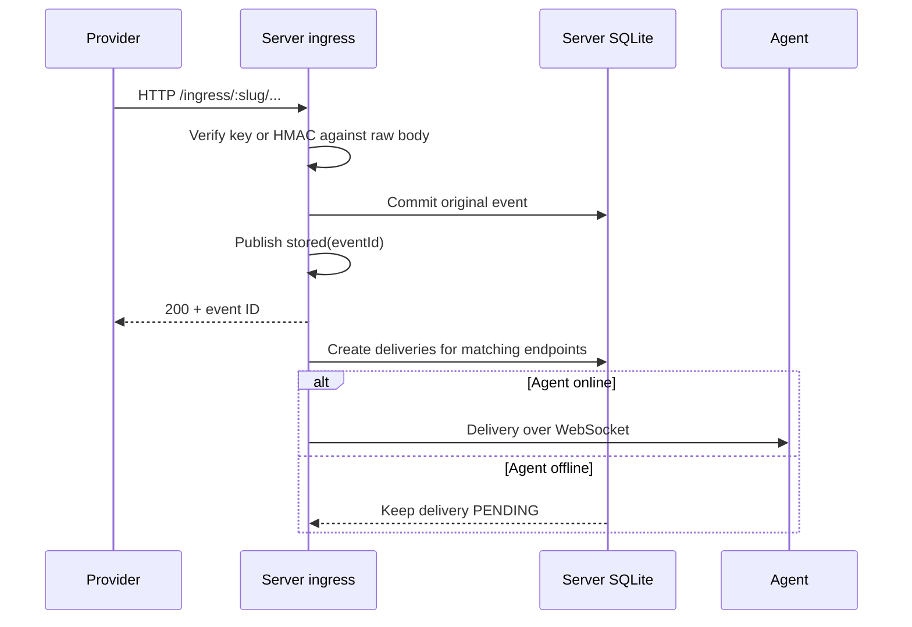

# Architecture and core flows

This document describes the behavior currently implemented in server, agent, core, and shared. See [api.md](api.md) for specific APIs and [operations.md](operations.md) for running the system and its release limits.

## Ownership boundaries

| Component         | Owns                                                                                                                                                | Does not own                                                    |
| ----------------- | --------------------------------------------------------------------------------------------------------------------------------------------------- | --------------------------------------------------------------- |
| Server            | HTTP ingress, original events, delivery backlog, WebSocket relay, ACK/result/replay records, tunnels/keys, collection and endpoint metadata, audit. | Local target calls, target secrets, local replay engine.        |
| Agent             | Local SQLite, relay connection, per-delivery forwarding, target secrets, local history/replay, offline config, proxy, retention, MCP.               | Server admin account, provider ingress.                         |
| CLI and Studio    | Call the Agent API for local operations and inspection.                                                                                             | Relay engine or duplicate business logic in the browser.        |
| Admin             | Calls the Server API using a Better Auth session.                                                                                                   | Target secrets, local proxy/retention, local inspection/replay. |
| `packages/shared` | Shared schemas, validation, and wire contracts.                                                                                                     | Database or IO.                                                 |
| `packages/core`   | Mappers, selectors, and reusable HTTP forwarding, retention, and config logic.                                                                      | Routes, sockets, daemons, or database connections.              |

Server and agent use separate SQLite databases, Drizzle schemas, and migrations. Collection and endpoint metadata have server and local copies so they can be edited while disconnected. Target secrets are stored **only** in the agent database.

## Provider → server → delivery

Ingress has two selectors: collection ID and target path. Each matching endpoint gets **one delivery**. Two endpoints with the same path get two deliveries; the agent does not fan out a second time. An event without matching endpoints remains stored but has no deliveries. Endpoints added later do not automatically receive older events.

Committing an event and preparing deliveries are separate transactions. HTTP 200 confirms **the event is stored**; it does not wait for delivery or the local target. If the process stops between those steps, recovery scans unprepared events at startup and periodically and creates deliveries idempotently. A failed event DB write must not return success.

By default, a tunnel requires an inbound `x-api-key` scoped to its slug. In signed mode, one of several provider signatures (GitHub, Stripe, standard webhooks, Shopify, Slack, or custom HMAC) replaces the inbound key; there is no key fallback. Providers that can neither send a custom header nor use one of these signatures are not supported: there is deliberately no key-in-URL mode, because URLs leak into proxies and logs. Retries are deduplicated by `X-GitHub-Delivery`, `webhook-id`/`svix-id`, `X-Shopify-Webhook-Id`, or the Stripe event ID. HMAC is verified against received bytes before storage. A failed verification creates no event or delivery, but writes an `ingress.hmac_failed` audit record containing attempt metadata only, without the payload or signature. Because anyone can reach a public ingress URL, at most one such record is written per tunnel and minute; the next record counts the attempts suppressed in between. If the audit cannot be written, the server returns an error rather than claiming to have recorded the rejection.

The body is stored as a BLOB and transported as base64 without parsing, stringifying, decompressing, or changing it. The raw query is stored separately to preserve its order and encoding. The HTTP runtime may normalize header casing and order; hop-by-hop headers are rebuilt for the new connection. An ingress `GET` or `HEAD` with a body that Bun cannot read completely is rejected with 400 before storage; these methods still work without a body.

## Server ↔ agent ↔ target

The agent connects to `GET /relay/:slug` using an outbound key in the `x-api-key` header, stored locally and attached to the handshake automatically. It also sends a stable instance ID (`x-pwr-agent-id`, from `agent.id` in its data directory). The server keeps **one active agent per tunnel**: the same agent may replace its own half-open socket, but a different agent is closed with code `4409` unless it sends `x-pwr-takeover: 1` (`pwr connect --takeover`). The agent that loses a takeover is also closed with `4409`. An agent closed with `4409` stops reconnecting, also after a restart, until it is connected again; otherwise two machines would trade the tunnel on every network blip. The server sends a batch of PENDING deliveries when the agent reconnects, and sends new deliveries while it is online, in the order their events were stored; the agent executes them in that order. The agent validates each frame, checks storage capacity, commits the event and package to local SQLite, then sends a receipt. If the connection drops before the receipt, the server keeps the delivery PENDING and resends it on reconnect.

| Message        | Meaning                                      | Server action                                                                    |
| -------------- | -------------------------------------------- | -------------------------------------------------------------------------------- |
| `ack_received` | Agent stored and accepted the package.       | Change receipt from `PENDING` to `DELIVERED`, set `receivedAt`, open next batch. |
| `ack_relayed`  | Agent forwarded to target and stored result. | Store `relayStatus`, timestamp, response status, latency and size.               |
| `ack_replayed` | Agent completed a distinct replay.           | Create a new delivery with replay ID and `replayOfDeliveryId`.                   |

The three ACKs are independent. `ack_relayed` does not replace `ack_received`; a target failure is still a `FAILED` result and does not automatically retry the target. ACKs carry **outcome metadata only** (status, HTTP status, latency, response size): the target URL, response headers and body stay in the agent DB. The server sends `result_committed` after committing a result or replay. This is a **transport confirmation**, not a fourth business ACK. The agent sets `reportedAt` only after receiving that confirmation. Reconnect and timers resend unconfirmed ACKs with stable IDs, and duplicates are handled idempotently: a retry whose result differs from the committed one is confirmed but never overwrites the first result. A result whose source delivery the server no longer has (pruned by server retention) is confirmed too, so the agent stops re-sending it and can prune its own copy.

**Target URLs are agent-owned.** The server's endpoints hold routing only (collection, path, active/paused); it never stores, sends or syncs a target URL. The agent resolves each delivery's target from its local `local_endpoint_targets` table at execution time, adds the endpoint's secret, sets `X-PWR-Delivery-Id` (plus `X-PWR-Replay-Of` for replays), and preserves the body. A delivery whose endpoint has no local target waits without blocking the queue until one is set; a target and secret saved in the same request commit together, so released work never goes out without its secret. A stored request that cannot be forwarded (corrupt header value) becomes a terminal `FAILED` result instead of stalling the tunnel. If the target was called but the result could not be committed (e.g. disk full), the agent stops draining and later retries **the commit**, not the target call. Replay selects a specific delivery, creates a new UUID and local record before calling the target, reuses the original event BLOB, and uses the current target and secret for the **same endpoint**. Replay works while the server is offline if the agent already has the payload; its ACK is reported after reconnect. Replay does not overwrite its source record, accept body/header/target overrides, or fan out to newly added endpoints.

The HTTP side effect at the target is **at-least-once**: a crash after the target handles a call but before the agent commits the result can lead to another call. Targets need their own idempotency if they require exactly-once effects.

## Offline metadata and conflicts

The agent stores a local version, server baseline, pending flag, and possible conflict for each collection or endpoint in SQLite. Local edits commit even while the server is offline. Once online, the agent pushes collections before endpoints, pulls in pages, and uses compare-and-set against the baseline; timestamps do not choose the winner. Secrets are not part of config sync.

If the same record changes on both sides, the agent **keeps the local version and reports a conflict** rather than silently overwriting it. The user chooses `local` to try pushing the local version over a new baseline, or `server` to accept the server version and discard the local edit. A conflict on one record does not block independent records. Server tombstones sync without deleting delivery or replay history.

## Agent retention and disk pressure

A package may be pruned only when it is terminal, its result has been confirmed by the server, it is past the age/count policy, and it has no dependent replay or ACK. An event BLOB is removed only when no package still uses it. Config, keys, secrets, pending work, conflicts, and unreported results are never pruned. Deduplication IDs remain in tombstones for **30 days after pruning**.

The same policy runs at startup, every minute, and during manual cleanup. When disk usage reaches its threshold and the remaining data cannot be removed safely, the agent reports `storage_blocked`, stops accepting new packages, and sends no false receipts. Reporting and result handling for already stored work may still finish; new replays are rejected. After space is freed, the agent reconnects and receives the server backlog.
